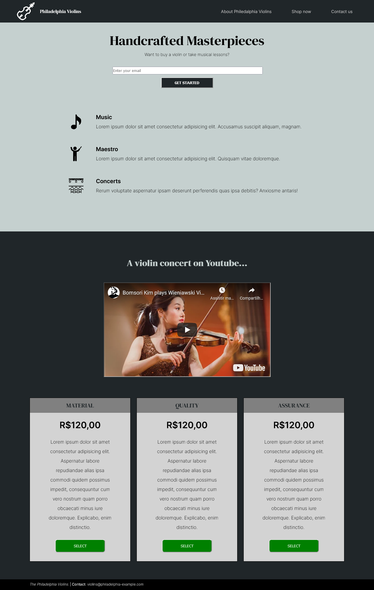

_This README.md file is in English and Portuguese. // Esse arquivo README.md está em Inglês e Português._

# EN: Freecodecamp #03 Responsive Web Design Project: Product Landing Page

This repository contains my solution to the freecodecamp #03 challenge on "Responsive Web Design Project". This is part of a series of incremental HTML and CSS Projects in order to obtain the "Responsive Web Design" certificate from Freecodechallenge.

This first challenge was supposed to create a very simple Tribute Page with HTML and CSS. The second challenge was meant to create a simple survey form with HTML and CSS. This third one was supposed to create a landing-page of a product of your choice. 

The product I chose were violins from Philadelphia. One of my favorite actress' family has a violin shop in the city. That's where the inspiration came from. All the content presented here is fake. 

## Responsive Web Design Projects:

1. Simple Ada Lovelace Tribute Page
2. A freeCodeCamp Survey Form
3. **A Product Landing-Page**

The main goal is to practice the content seen in the course in order to achieve the necessary solution required to go to the next step.

### MY SOLUTION

# EN: Freecodecamp #01 Responsive Web Design Project: Tribute Page

Esse repositório contém a minha solução para o desafio número 03 do freecodecamp do curso "Responsive Web Design". Isso é parte de uma série de projetos incrementais em HTML e CSS requisitados para obtenção do certificado em "Responsive Web Design" do Freecodecamp.

O primeiro desafio era para criar um versão muito simples de uma página tributo ("homenagem") feita apenas em HTML e CSS. O segundo desafio era criar um formulário de perguntas também feito em HTML e CSS. Este terceiro projeto é a criação de uma landing-page de um produto. 

O produto que eu escolhi foram violinos da Filadélfia. A família de uma das atrizes que mais admiro tem uma loja de violinos na cidade. Daí surgiu a inspiração. Todo o conteúdo usado é propositalmente falso. 

## Projetos do "Responsive Web Design Projects":

1. Simple Ada Lovelace Tribute Page
2. A freeCodeCamp Survey Form
3. **A Product Landing-Page**

O principal objetivo é praticar o conteúdo visto no curso e alcançar a solução necessária para ir para a próxima etapa.

### MY SOLUTION
